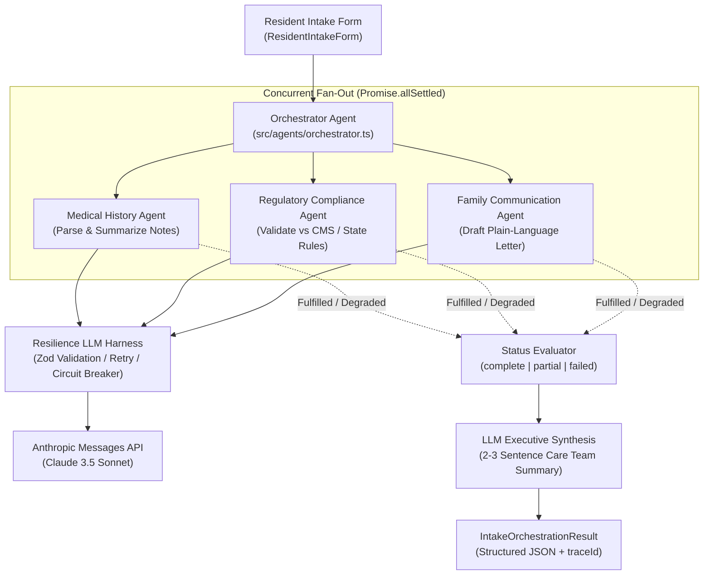
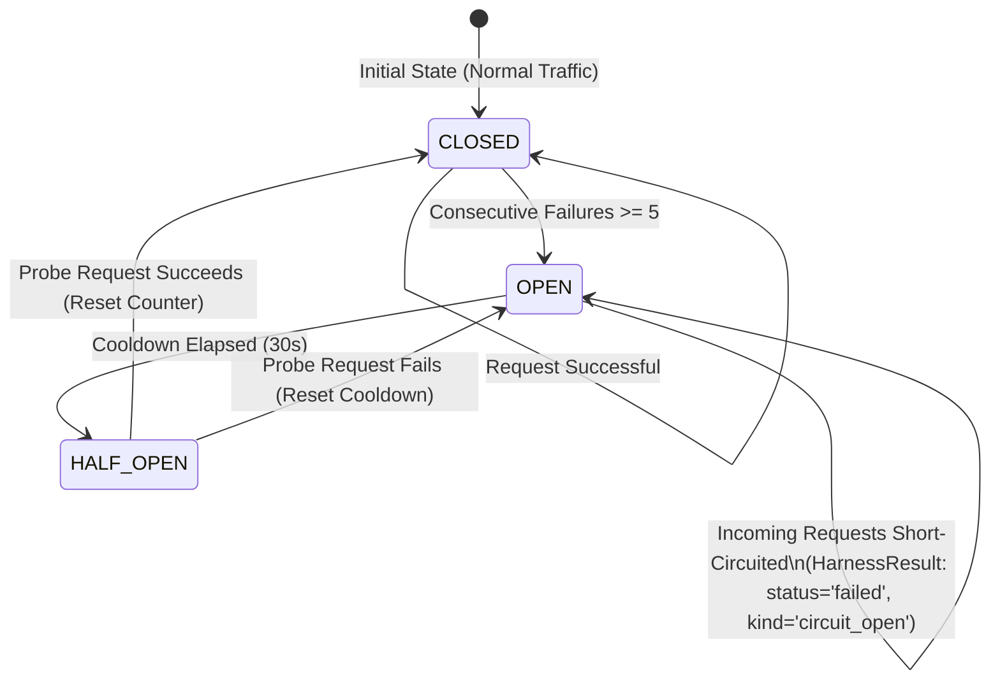
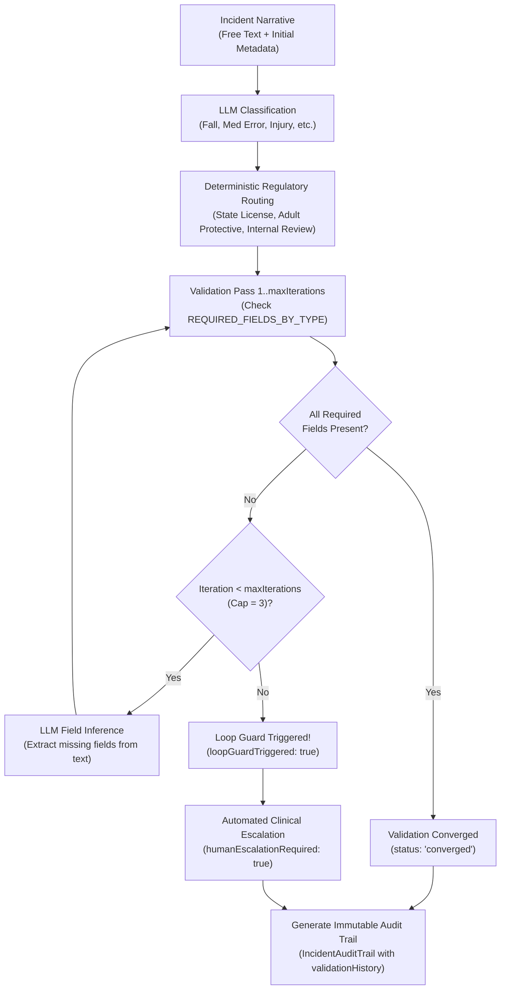

# Multi-Agent Swarm AI Orchestration Layer

> **Production-grade multi-agent orchestration architecture designed for regulated healthcare and assisted living environments.** Features a resilient LLM harness with circuit breaking, fault-tolerant concurrent sub-agent swarms, and self-healing incident reporting workflows with tamper-evident audit trails.

[](https://www.typescriptlang.org/)
[](https://nodejs.org/)
[](https://vitest.dev/)
[](https://biomejs.dev/)
[](docs/security.md)
[](LICENSE)

---

## Executive Summary

Deploying autonomous agents in mission-critical, regulated sectors (such as residential elderly care facilities and healthcare CRM platforms) exposes three systemic vulnerabilities:

1. **Cascading Provider Outages**: Direct LLM API integrations fail under rate limits (HTTP 429), timeouts, and upstream degradation, locking operations and exhausting quotas.
2. **Brittle Agent Coordination**: Naive multi-agent orchestration (`Promise.all`) aborts whole workflows when an auxiliary agent fails, leaving clinical intake pipelines stalled.
3. **Unbounded Non-Deterministic Drift**: Freeform agent loops risk hallucinating policy checks, drifting indefinitely, or leaking Protected Health Information (**PHI**) into telemetry streams.

This system resolves these vulnerabilities through three hardened architectural modules:
- **Resilience Harness (`src/harness/`)**: Reusable wrapper managing provider interaction with a 3-state circuit breaker, `Retry-After` header honoring, backoff with randomized jitter, client dependency injection, and a 4-layer HIPAA Safe Harbor PHI scrubbing engine.
- **Resident Intake Swarm (`src/agents/`)**: Concurrent multi-agent fan-out via `Promise.allSettled`, strict Zod schema message boundaries, fault-isolated partial execution, and LLM executive synthesis with generic fallback.
- **Self-Healing Incident Engine (`src/incident/`)**: Hybrid deterministic-probabilistic workflow combining LLM clinical classification, deterministic regulatory routing tables (`REQUIRED_FIELDS_BY_TYPE`), bounded inference loops with hard anti-runaway guards (`maxIterations: 3`), automated human clinical escalation, and immutable JSON audit trails (45 CFR § 164.312(b)).

---

## Architectural Diagrams

### 1. Multi-Agent Intake Swarm Execution Flow



---

### 2. Circuit Breaker State Machine



---

### 3. Dynamic Incident Reporting & Convergent Loop



---

## Core Engineering Pillars

### Pillar 1: Resilient LLM Harness (`src/harness/`)
The harness is the sole gateway to external LLM providers, ensuring consistent operational semantics:
- **Full Retry Policy Ownership**: Anthropic SDK internal retries are disabled (`maxRetries: 0`) to prevent uncoordinated nested retries.
- **Provider-Aware Backoff**: Honors HTTP 429 `Retry-After` headers (both delta-seconds and HTTP-dates). Falls back to exponential backoff with randomized jitter (`baseMs * 2^attempt + jitterMs`) to eliminate the thundering herd problem.
- **Error Classification**: Distinguishes transient retryable errors (`429 RateLimit`, `5xx Server`, `Timeout`, `Network`) from fatal client errors (`400 Bad Request`, `401 Auth`, `403 Forbidden`, `404 Not Found`). Non-retryable errors fail immediately without burning API tokens.
- **Circuit Breaker**: Protects downstream systems when a provider is unavailable. Transitions from `CLOSED` to `OPEN` after 5 consecutive failures, short-circuiting calls with typed `circuit_open` errors for a 30s cooldown before admitting a single `HALF_OPEN` probe.
- **HIPAA Safe Harbor PHI Redaction**: Four-layer pipeline (`JSON tree walker`, `fenced markdown blocks`, `colon scanner`, `format regexes`) scrubs SSNs, MRNs, DOBs, medication lists, and contact data prior to log output. Logging is metadata-only by default (`HARNESS_LOG_CONTENT=false`).
- **Distributed Traceability**: Generates and binds a UUID `traceId` per call, propagates upstream Anthropic `_request_id` values, and tracks token consumption and millisecond latency.

### Pillar 2: Concurrent Multi-Agent Swarm (`src/agents/`)
Coordinates intake workflows across dedicated domain sub-agents:
- **Strict Domain Boundaries**:
  - `MedicalHistoryAgent`: Extracts clinical history, active medications, allergies, and diagnoses into a structured risk profile (`low | medium | high`).
  - `ComplianceAgent`: Validates planned care levels against CMS Conditions of Participation and state codes (e.g. California Title 22), scoring compliance from 0–100.
  - `FamilyCommunicationAgent`: Generates plain-language, empathetic onboarding letters for family members without medical jargon.
  - `OrchestratorAgent`: Coordinates the swarm, aggregates results, and synthesizes an executive summary.
- **Non-Blocking Fault Isolation**: Dispatches sub-agents using `Promise.allSettled`. If a sub-agent fails or times out, remaining agents complete uninterrupted. The orchestrator flags incomplete domains (`incomplete: ['family-communication']`), computes status (`complete | partial | failed`), and continues execution.
- **LLM Executive Synthesis with Fallback**: The orchestrator invokes the harness to synthesize an executive summary. If synthesis fails, it falls back to a deterministic template, guaranteeing the workflow never throws an unhandled rejection.

### Pillar 3: Self-Healing Incident Engine (`src/incident/`)
Handles regulatory incident triage and reporting under statutory deadlines:
- **Hybrid Intelligence Architecture**: Freeform text classification uses LLM intelligence, but validation uses **compile-time deterministic rule tables** (`REQUIRED_FIELDS_BY_TYPE`).
- **Missing Field Inference Loop**: Missing regulatory fields (e.g. `fallLocation`, `witnessesPresent`, `immediateInterventions`) are iteratively extracted from clinical notes across bounded passes.
- **Anti-Runaway Loop Guard**: Enforces a strict `maxIterations: 3` cap. If clinical notes lack required information, the engine halts, trips `loopGuardTriggered: true`, flags `humanEscalationRequired: true`, and assigns a clinical reviewer.
- **Regulatory Audit Trail (45 CFR § 164.312(b))**: Emits an immutable record detailing classification confidence, assigned regulatory pathways, iteration-by-iteration missing/inferred fields, and operational warnings.

---

## Repository Structure

```
care-agent-swarm/
├── README.md                          ← Technical showcase & system overview
├── AGENTS.md                          ← AI agent rules & operational context
├── opencode.json                      ← OpenCode permissions & environment spec
├── package.json                       ← Package manifest (Node >=20, ES Modules)
├── tsconfig.json                      ← TypeScript strict configuration
├── biome.json                         ← Biome linter & formatter configuration
├── vitest.config.ts                   ← Vitest test runner configuration
├── .env.example                       ← Environment variable template
│
├── data/
│   ├── sample-intake.json             ← Clinical sample: Margaret Thompson (Assisted Living)
│   └── sample-incident.json           ← Clinical sample: Robert Chen (Fall in bathroom)
│
├── docs/
│   ├── architecture.md                ← Deep dive: system architecture & state machines
│   ├── security.md                    ← HIPAA compliance, 4-layer redaction & threat model
│   └── testing.md                     ← Testing philosophy, client DI & verification
│
├── src/
│   ├── index.ts                       ← CLI smoke entry point
│   ├── harness/                       ← Reusable LLM Resilience Layer
│   │   ├── client.ts                  ← Anthropic client factory & DI interface
│   │   ├── schemas.ts                 ← Zod schemas for harness I/O & errors
│   │   ├── retry.ts                   ← Backoff math, Retry-After & error classification
│   │   ├── circuit-breaker.ts         ← CLOSED / OPEN / HALF_OPEN state machine
│   │   ├── logger.ts                  ← Pino logging + 4-layer PHI redaction engine
│   │   ├── harness.ts                 ← Core LLMHarness implementation
│   │   └── index.ts                   ← Public harness exports
│   │
│   ├── agents/                        ← Resident Intake Multi-Agent Swarm
│   │   ├── contracts.ts               ← Zod I/O schemas for all sub-agents
│   │   ├── subagent.ts                ← SubAgent factory with error containment
│   │   ├── medical-history.ts         ← Clinical note parsing & risk classification
│   │   ├── compliance.ts              ← Regulatory care plan validation & scoring
│   │   ├── family-communication.ts    ← Plain-language family onboarding letter
│   │   ├── orchestrator.ts            ← Swarm coordinator & executive synthesis
│   │   └── index.ts                   ← Public agent exports
│   │
│   ├── incident/                      ← Dynamic Incident Reporting Workflow
│   │   ├── schemas.ts                 ← Zod schemas for incidents & audit trail
│   │   ├── routes.ts                  ← REQUIRED_FIELDS_BY_TYPE & regulatory routing
│   │   ├── classify.ts                ← LLM classification & missing field inference
│   │   ├── workflow.ts                ← Convergent loop with max-iteration guard
│   │   └── index.ts                   ← Public incident exports
│   │
│   └── demo/                          ← Interactive Terminal Verification
│       ├── fakes.ts                   ← Deterministic FakeAnthropicClient
│       ├── format.ts                  ← ANSI terminal rendering & layout
│       └── run-all.ts                 ← 3-scenario interactive test runner
│
└── tests/
    ├── harness.test.ts                ← 25 tests: retries, circuit breaker, redaction, timeouts
    ├── swarm.test.ts                  ← 6 tests: Promise.allSettled, partial states, synthesis
    └── incident.test.ts               ← 11 tests: classification, loops, guards, audit trails
```

---

## Quick Start

### Prerequisites
- Node.js >= 20.0.0 (tested on Node 22)
- npm >= 10.0.0

### 1. Installation
```bash
git clone https://github.com/your-org/care-agent-swarm.git
cd care-agent-swarm
npm install
```

### 2. Run Deterministic Interactive Demos (Zero API Key Required)
The project includes a fully scripted `FakeAnthropicClient` enabling reproducible terminal runs without external network dependencies:

```bash
npm run demo
```

This executes all three core scenarios:
1. **Harness Rate-Limit Recovery**: Simulates an HTTP 429 response with a `Retry-After: 1` header. The harness captures the header, backs off, retries, and succeeds.
2. **Swarm Partial Failure & Continuation**: Simulates an outage in the family-communication sub-agent. The orchestrator continues, marks the agent `incomplete`, and synthesizes a partial executive summary.
3. **Incident Loop Guard & Human Escalation**: Simulates missing clinical data that cannot be inferred. After 3 iterations, the loop guard triggers and escalates to a human reviewer with a full audit trail.

### 3. Run Automated Tests
```bash
npm test
```
Executes all 42 unit and integration tests in **<300ms** via Vitest with zero test flakiness.

### 4. Run Against Real Anthropic Claude API
To exercise real Claude 3.5 Sonnet endpoints:
```bash
cp .env.example .env
# Edit .env and supply your ANTHROPIC_API_KEY
# Set DEMO_MODE=false
npm run dev
```

---

## Configuration & Environment Variables

All settings are strongly typed and configurable via environment variables:

| Variable | Default | Description |
|---|---|---|
| `DEMO_MODE` | `true` | When `true`, uses `FakeAnthropicClient` (deterministic, zero API cost). Set to `false` for live calls. |
| `ANTHROPIC_API_KEY` | _(unset)_ | Anthropic API key. Required when `DEMO_MODE=false`. Read from environment only; never hardcoded. |
| `ANTHROPIC_MODEL` | `claude-sonnet-4-5` | Model identifier for Anthropic Messages API calls. |
| `HARNESS_MAX_ATTEMPTS` | `3` | Maximum call attempts (1 initial attempt + 2 retries). |
| `HARNESS_TIMEOUT_MS` | `20000` | Per-call timeout in milliseconds. Harness returns `status: 'degraded'` on expiry. |
| `HARNESS_BASE_BACKOFF_MS` | `500` | Base delay for exponential backoff calculations. |
| `HARNESS_MAX_BACKOFF_MS` | `30000` | Upper ceiling for exponential backoff and `Retry-After` waits. |
| `HARNESS_JITTER_MS` | `1000` | Maximum randomized jitter added to backoff delays to prevent thundering herds. |
| `HARNESS_LOG_CONTENT` | `false` | When `false`, logs metadata only. When `true`, logs prompt/output passed through 4-layer PHI redaction. |
| `CIRCUIT_FAILURE_THRESHOLD` | `5` | Consecutive retryable failures required to transition circuit breaker to `OPEN`. |
| `CIRCUIT_COOLDOWN_MS` | `30000` | Cooldown period before an `OPEN` circuit transitions to `HALF_OPEN`. |
| `LOG_LEVEL` | `info` | Pino log level (`trace`, `debug`, `info`, `warn`, `error`). |

---

## Verification & Quality Assurance

The codebase enforces strict verification via automated CI pipelines:

```bash
# Static type verification (zero errors)
npm run build

# Code linting & formatting inspection
npm run lint

# Auto-fix formatting and linting rules
npm run lint:fix
npm run format
```

### Verification Highlights
- **42 Automated Tests**: Covering backoff timing, circuit transitions, redaction, and incident non-convergence.
- **Contract-Driven Testing**: Injected timers and client dependency injection eliminate brittle wall-clock delays.
- **Strict Biome Linter**: Uniform formatting and code style across 100% of TypeScript modules.

---

## Deep Dive Technical Documentation

For in-depth architectural and security analyses, refer to the documentation suite:
- **[System Architecture Deep Dive](docs/architecture.md)**: State machine specifications, concurrency tradeoffs, error classification matrices, and operational semantics.
- **[Security & HIPAA Compliance](docs/security.md)**: 4-layer PHI redaction algorithms, Safe Harbor de-identification, 45 CFR § 164.312(b) audit trail compliance, and threat model.
- **[Testing Architecture & Philosophy](docs/testing.md)**: Contract-based assertions, client dependency injection, and zero-flake resilience test design.

---

## License

Distributed under the MIT License. See [LICENSE](LICENSE) for details.
